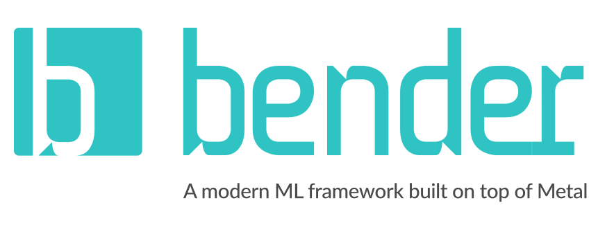

# Bender

<p align="left">
<a href="https://travis-ci.org/xmartlabs/Bender"></a>

<a href="https://developer.apple.com/swift"></a>
<!-- <a href="https://github.com/Carthage/Carthage"></a> -->
<a href="https://cocoapods.org/pods/MetalBender"></a>
<a href="https://raw.githubusercontent.com/xmartlabs/Bender/master/LICENSE"></a>
</p>



Bender is an abstraction layer over MetalPerformanceShaders useful for working with neural networks.

## Contents
* [Introduction](#introduction)
* [Why did we need Bender](#why)
* [Basic usage](#basic-usage)
* [Requirements](#requirements)
* [Getting involved](#getting-involved)
* [Examples](#examples)
* [Installation](#installation)
* [Changelog](#changelog)

The documentation can be found under the `Documentation` folder:
* [API](Documentation/API.md) contains the most important information to get started.
* [Supported Layers] explains which layers are supported and how they map to TensorFlow ops.
* [Importing] explains how to import models from other frameworks such as TensorFlow. You can also find information on how to enhance this functionality for custom implementations.

## Introduction

Bender is an abstraction layer over MetalPerformanceShaders which is used to work with neural networks. It is of growing interest in the AI environment to execute neural networks on mobile devices even if the training process has been done previously. We want to make it easier for everyone to execute pretrained networks on iOS.

Bender allows you to easily define and run neural networks using the most common layers like Convolution, Pooling, FullyConnected and some normalizations among others. It is also flexible in the way it receives the parameters for these layers.

We also want to support loading models trained on other frameworks such as TensorFlow or Caffe2. Currently Bender includes an adapter for TensorFlow that loads a graph with variables and "translates" it to Bender layers. This feature supports a subset of TensorFlow's operations but we plan to enhance it to cover more cases.

Bender is functional but still under active development and we also want to see where the needs of the community drive it. Please, note that the API is not stable yet.

## Why did we need Bender? <a name="why"></a>

At [Xmartlabs] we were about to start a Machine Learning project and investigated frameworks to use in iOS. We found MetalPerformanceShaders useful but not very user friendly and we saw ourselves repeating a lot of code and information. That is why we starting building a framework to handle that kind of stuff.

We also found ourselves creating scripts to translate the models we had from training with TensorFlow to iOS. This means transposing the weights to the MPSCNN format and also mapping the parameters of the different kinds of layers in TensorFlow to the parameters used by the MPSCNN kernels. TensorFlow can be compiled for iOS but currently it does not support running on GPU which we wanted to do. We also did not want to include TensorFlow's static library into our project. This is why we also started to work on an adapter that would parse a TF graph and translate it to our Bender layers. 

## Usage

You can define your own network in Bender using our custom operator or you can load a model exported from TensorFlow. Defining a network and loading a model can be done like this:

```swift
import Bender

// Define a network and how it will load its weights / parameters
let randomLoader = RandomParameterLoader(maxSize: 7*7*64*1024)
network = Network(device: device, inputSize: LayerSize(f: 3, w: 256), parameterLoader: randomLoader)

// Convert a graph from TensorFlow
let url = Bundle.main.url(forResource: "myGraph", withExtension: "pb")!
let converter = TFConverter.default()
network.nodes = converter.convertGraph(file: url, type: .binary)

// Initialize the network
network.initialize()

// Run the network
let inputImage = ...
network.run(inputImage: image, queue: commandQueue) { output in
    ...
}
```

You can read more information about this in [Importing](Documentation/Importing.md).

If you want to define your network yourself you can do it like this:

```swift

let network = ...

network.start
    ->> Convolution(convSize: ConvSize(outputChannels: 16, kernelSize: 3, stride: 2))
    ->> InstanceNorm()
    ->> Convolution(convSize: ConvSize(outputChannels: 32, kernelSize: 3, stride: 2), neuronType: .relu)
    ->> InstanceNorm()
    ->> FullyConnected(neurons: 128)
    ->> Neuron(type: .tanh)
    ->> FullyConnected(neurons: 10)
    ->> Softmax()
...
```

To know more about this have a look at [API](Documentation/API.md).


## Requirements

* iOS 10.0+
* Xcode 8.3+

## Getting involved

* If you **want to contribute** please feel free to **submit pull requests**.
* If you **have a feature request** please **open an issue**.
* If you **found a bug** or **need help** please **check older issues, [FAQ](#faq) and threads on [StackOverflow](http://stackoverflow.com/questions/tagged/Bender) (Tag 'Bender') before submitting an issue.**.

Before contribute check the [CONTRIBUTING] file for more info.

If you use **Bender** in your app We would love to hear about it! Drop us a line on [twitter](https://twitter.com/xmartlabs).

## Examples

Follow these steps to run the examples: 
* Clone Bender repository (or download it).
* Run `carthage update --platform iOS` in the downloaded folder.
* Open Bender workspace and run the *Example* project.

## Installation

#### CocoaPods

To install Bender, simply add the following line to your Podfile:

```ruby
pod 'MetalBender', :git => 'https://github.com/xmartlabs/Bender.git'
```

> Remember that Bender compiles for iOS 10. So you must add `platform :ios, '10.0'` to your Podfile

<!-- #### Carthage

[Carthage](https://github.com/Carthage/Carthage) is a simple, decentralized dependency manager for Cocoa.

To install Bender, simply add the following line to your Cartfile:

```ogdl
github "xmartlabs/Bender" ~> 1.0
``` -->

## Author

* [Xmartlabs SRL](https://github.com/xmartlabs) ([@xmartlabs](https://twitter.com/xmartlabs))


# Change Log

This can be found in the [CHANGELOG.md](CHANGELOG.md) file.

<!-- Links -->
[Xmartlabs]: http://xmartlabs.com
[Importing]: Documentation/Importing.md
[CONTRIBUTING]: https://github.com/xmartlabs/Bender/blob/master/CONTRIBUTING.md
[API]: Documentation/API.md
[Supported Layers]: Documentation/Supported_Layers.md
